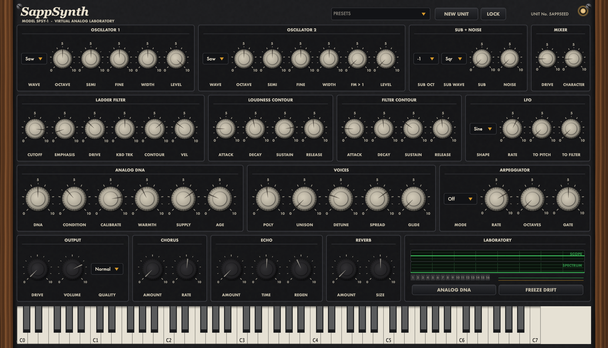

# SappSynth

<!-- UPDATE WHEN: the one-line description changes, or the repo's top-level layout changes -->

A serious virtual-analog synthesizer that lets you hear, inspect, and
understand why it sounds the way it does. VST3 · Audio Unit · Standalone —
C++20, JUCE 8, CMake.



Two oscillators (PolyBLEP), a nonlinear zero-delay-feedback ladder filter
with self-oscillation, a modeled VCA, and **structured** analog character:
every virtual unit has its own manufacturing tolerances, every voice card its
own circuit, every note its own micro-variation, all driven by a
deterministic seed hierarchy — same seed, bit-identical render. Unison,
glide, chorus/echo/reverb, and a built-in phosphor-scope Lab view with
ideal-vs-modeled A/B. The entire vintage panel — walnut, crinkle paint,
bakelite filmstrip knobs — is generated by `scripts/generate_ui_assets.py`.

## Build

Requires CMake ≥3.24 and a C++20 compiler (Xcode clang tested). JUCE 8.0.15
and Catch2 are fetched automatically.

```bash
git clone https://github.com/localteampartners/sappsynth.git
cd sappsynth
cmake -B build -DCMAKE_BUILD_TYPE=Release
cmake --build build -j8
```

Artefacts land in `build/SappSynthPlugin_artefacts/Release/` (Standalone
app, `SappSynth.vst3`, `SappSynth.component`) and are copied into
`~/Library/Audio/Plug-Ins/` on macOS. `auval -v aumu Spsy Ltpr` passes.

Fast development loop (core + tests, no JUCE):

```bash
./verify.sh
```

## Offline tools

```bash
./build-core/sapp-render out.wav --note 48 --res 0.9 --quality high --seed 1001
./build-core/sapp-bench                      # CPU per quality mode
python3 scripts/analyze_wav.py out.wav       # spectrum plot
python3 scripts/compare_renders.py a.wav b.wav
```

## Design

The whole build follows [docs/architecture.md](docs/architecture.md) — DSP
core with no framework dependency, realtime-safe audio thread contract,
quality modes as prepared configurations, alias-energy regression tests.
Current status: `_project/CURRENT_STATE.md`; roadmap: `_project/TODO.md`.

## Project documentation

All orientation docs live in [`_project/`](_project/). Start with
[_project/README.md](_project/README.md) — it's a 1-page index into everything
else (spec, architecture, current state, runbook, infra, decisions, etc.).

If you're an agent opening this repo, read [CLAUDE.md](CLAUDE.md) first.

## Where releases are built

Tags are built by a **self-hosted GitHub Actions runner on the Windows
machine** (`desktop-14886fp`), not by GitHub's hosted runners — hosted minutes
are billed and the account is currently blocked. Windows jobs read:

```yaml
runs-on: ${{ vars.WINDOWS_RUNNER || 'windows-latest' }}
```

so the repo variable `WINDOWS_RUNNER=self-hosted` sends builds to that
machine, and deleting the variable sends them back to GitHub. No workflow
edits either way.

**Every repo needs its own runner.** The account is a GitHub *user*, not an
organisation, and user accounts can't share runners across repos — so each
repo gets its own registration (its own folder and Windows service) on the
same machine. The prerequisites are installed once and shared: Git, CMake
3.24+, and Visual Studio 2022 Build Tools with the "Desktop development with
C++" workload.

Full setup, including the per-repo registration steps:
[sapptune/RUNNER.md](https://github.com/localteampartners/sapptune/blob/master/RUNNER.md).

**Builds are Windows-only** — macOS jobs were removed on 2026-08-08.
