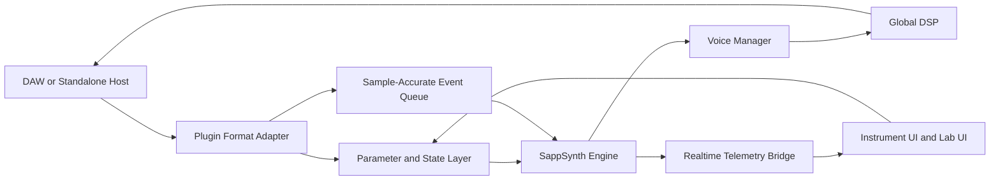
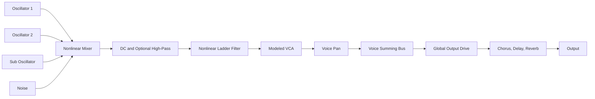

# SappSynth Architecture Plan

**Project:** SappSynth  
**Purpose:** A professional virtual-analog software synthesizer and an interactive laboratory for learning how synthesizers work  
**Primary targets:** VST3, Audio Unit, CLAP, and standalone desktop application  
**Recommended language:** C++20  
**Recommended framework:** JUCE 9 with CMake  
**Document version:** 1.0  
**Date:** August 5, 2026

---

## 1. Executive Summary

SappSynth should not be built as a collection of generic oscillator, filter, envelope, and effect classes wired directly to a GUI. That approach can produce a functioning synth, but it usually produces a clean, static, obviously digital instrument.

A professional virtual-analog synth needs to model several layers of behavior at once:

1. **Ideal signal generation**
   - Accurate pitch
   - Band-limited waveforms
   - Stable modulation
   - Correct envelope timing

2. **Circuit-like nonlinear behavior**
   - Oscillator waveform asymmetry
   - Mixer saturation
   - Ladder-filter stage saturation
   - Nonlinear resonance feedback
   - VCA and output coloration

3. **Structured imperfection**
   - Per-unit component tolerances
   - Per-voice differences
   - Per-note variation
   - Slow oscillator drift
   - Thermal warm-up behavior
   - Correlated instability between components

4. **Professional plugin behavior**
   - Sample-accurate event handling
   - Smooth automation
   - Deterministic preset recall
   - No memory allocation or locking on the audio thread
   - Reliable validation in multiple DAWs

5. **An educational laboratory**
   - Solo and bypass every signal stage
   - Compare ideal and modeled versions
   - Visualize waveforms, spectra, modulation, drift, filter poles, and gain staging
   - Run controlled experiments
   - Export measurements and audio examples

The recommended architecture is a **framework-independent DSP core** wrapped by a thin plugin layer. JUCE handles plugin formats, host communication, windowing, state serialization, and platform support. SappSynth's sound engine remains independent enough to run in unit tests, offline renderers, command-line tools, and future mobile or embedded applications.

The synth should begin as a focused two-oscillator subtractive instrument with one excellent ladder filter. It should not begin as a giant modular workstation. Depth, measurement, and sound quality matter more than feature count.

---

## 2. Product Vision

SappSynth should feel like two products sharing one engine.

### 2.1 Instrument Mode

Instrument Mode is the polished musical synthesizer.

Its goals are:

- Immediate, musical sound
- Low CPU use in normal quality mode
- Convincing analog character without sounding randomly detuned
- Fast preset browsing
- Good MIDI and MPE behavior
- Clear modulation workflow
- Useful gain staging
- Excellent default patches

### 2.2 Lab Mode

Lab Mode exposes the engine so the user can understand what is happening.

Its goals are:

- Compare ideal and modeled DSP
- Hear individual circuit stages
- Inspect per-voice differences
- Freeze or exaggerate drift
- Show aliasing and oversampling effects
- Visualize resonance feedback
- Measure harmonic distortion
- Record repeatable experiments
- Teach synthesis through direct interaction

Lab Mode is not a decorative oscilloscope. It is a controlled experimental environment connected to the actual production DSP engine.

---

## 3. Recommended Technology Stack

## 3.1 Core Stack

| Layer | Recommendation | Reason |
|---|---|---|
| Language | C++20 | Predictable performance, mature audio ecosystem, SIMD access, broad plugin support |
| Build system | CMake | Reproducible cross-platform builds and CI integration |
| Plugin framework | JUCE 9 | VST3, AU, CLAP, standalone, MIDI, GUI, state handling, host integration |
| DSP core | Custom SappSynth library | Prevents framework lock-in and makes testing easier |
| Unit testing | Catch2 or JUCE UnitTest | Fast deterministic DSP testing |
| Benchmarking | Google Benchmark or custom offline harness | CPU and allocation tracking |
| Plugin validation | pluginval, Steinberg validator, auval | Host and format compliance |
| Analysis | Python scripts plus NumPy/SciPy for offline verification | Reference plots, impulse analysis, harmonic analysis |
| CI | GitHub Actions | Repeatable macOS and Windows builds and tests |

### Version-Pinning Note

JUCE 9 is newly released as of July 2026. Pin SappSynth to an exact tested JUCE tag rather than following the development branch. Keep the plugin adapter thin because JUCE's next-generation `AudioProcessor` work, including deeper sample-accurate automation and CLAP capabilities, is still evolving. If a required host combination proves unstable, the DSP core should remain usable with a temporary JUCE 8 plus CLAP-extension wrapper.

## 3.2 Plugin Format Order

Build and validate formats in this order:

1. Standalone development application
2. VST3
3. Audio Unit on macOS
4. CLAP
5. Optional AAX after the product is mature

The standalone application should be treated as a first-class development host. It should expose debugging tools that are not appropriate inside a DAW.

## 3.3 Licensing Decision

JUCE licensing must be resolved before commercial distribution. Keep the DSP core in its own library so licensing or framework changes do not require rewriting the synthesis engine.

---

## 4. High-Level Architecture



The plugin adapter must never contain core sound-design logic. It translates host concepts into engine concepts.

### 4.1 Major Subsystems

- **Plugin Adapter**
  - AudioProcessor and editor integration
  - VST3, AU, and CLAP format details
  - Audio and MIDI bus configuration
  - Host tempo and transport information
  - State save and restore

- **Parameter System**
  - Stable parameter IDs
  - Normalized values
  - Unit conversion
  - Automation smoothing
  - Modulation-safe parameter snapshots

- **Event System**
  - Note events
  - Note expression and MPE
  - Parameter events
  - Transport changes
  - Sample offsets within the current block

- **Voice Manager**
  - Allocation and stealing
  - Unison
  - Mono and legato modes
  - Voice component profiles
  - Per-note randomization

- **Voice DSP**
  - Oscillators
  - Noise
  - Mixer
  - Filter
  - Amplifier
  - Voice modulation

- **Global DSP**
  - Global modulation
  - Voice summing
  - Output drive
  - Effects
  - Limiting and metering

- **Telemetry Bridge**
  - Lock-free snapshots from DSP to UI
  - Scope samples
  - Spectral input buffers
  - Drift state
  - Voice status
  - CPU timing

- **Experiment System**
  - Controlled test configurations
  - Parameter sweeps
  - Offline rendering
  - Comparison exports

---

## 5. Repository Layout

```text
SappSynth/
├── CMakeLists.txt
├── cmake/
│   ├── CompilerWarnings.cmake
│   ├── Sanitizers.cmake
│   └── Packaging.cmake
├── external/
│   ├── JUCE/
│   └── Catch2/
├── source/
│   ├── plugin/
│   │   ├── PluginProcessor.cpp
│   │   ├── PluginEditor.cpp
│   │   ├── PluginState.cpp
│   │   └── HostEventAdapter.cpp
│   ├── engine/
│   │   ├── SynthEngine.cpp
│   │   ├── VoiceManager.cpp
│   │   ├── SynthVoice.cpp
│   │   ├── RenderContext.h
│   │   └── QualityMode.h
│   ├── dsp/
│   │   ├── oscillators/
│   │   │   ├── PhaseAccumulator.h
│   │   │   ├── BandLimitedOscillator.cpp
│   │   │   ├── VCOModel.cpp
│   │   │   ├── PolyBlep.h
│   │   │   └── MinBlepTable.cpp
│   │   ├── filters/
│   │   │   ├── LadderFilter.cpp
│   │   │   ├── LadderSolver.cpp
│   │   │   ├── StateVariableFilter.cpp
│   │   │   └── FilterSaturation.h
│   │   ├── nonlinear/
│   │   │   ├── Saturators.h
│   │   │   ├── ADAA.h
│   │   │   ├── MixerModel.cpp
│   │   │   └── VcaModel.cpp
│   │   ├── modulation/
│   │   │   ├── Envelope.cpp
│   │   │   ├── Lfo.cpp
│   │   │   ├── ModMatrix.cpp
│   │   │   └── ModulationCompiler.cpp
│   │   ├── variation/
│   │   │   ├── ComponentProfile.cpp
│   │   │   ├── DriftProcess.cpp
│   │   │   ├── ThermalModel.cpp
│   │   │   └── RandomSource.cpp
│   │   ├── oversampling/
│   │   │   └── OversamplingManager.cpp
│   │   ├── utility/
│   │   │   ├── SmoothedValue.h
│   │   │   ├── DenormalGuard.h
│   │   │   ├── FastMath.h
│   │   │   └── SIMD.h
│   │   └── effects/
│   │       ├── Chorus.cpp
│   │       ├── Delay.cpp
│   │       └── Reverb.cpp
│   ├── parameters/
│   │   ├── ParameterRegistry.cpp
│   │   ├── ParameterSnapshot.h
│   │   ├── ParameterSmoother.cpp
│   │   └── ParameterUnits.cpp
│   ├── presets/
│   │   ├── PresetManager.cpp
│   │   ├── PresetSchema.json
│   │   └── Migration.cpp
│   ├── telemetry/
│   │   ├── TelemetryBus.cpp
│   │   ├── ScopeCapture.cpp
│   │   └── PerformanceCounters.cpp
│   ├── lab/
│   │   ├── ExperimentRunner.cpp
│   │   ├── SignalAnalyzer.cpp
│   │   ├── OfflineRenderer.cpp
│   │   └── ComparisonSession.cpp
│   └── ui/
│       ├── InstrumentView.cpp
│       ├── LabView.cpp
│       ├── ModulationView.cpp
│       ├── Oscilloscope.cpp
│       └── SpectrumView.cpp
├── tests/
│   ├── unit/
│   ├── dsp_reference/
│   ├── regression/
│   ├── realtime/
│   └── presets/
├── tools/
│   ├── sapp-render/
│   ├── sapp-analyze/
│   └── generate_blep_tables/
├── scripts/
│   ├── analyze_sweep.py
│   ├── plot_filter_response.py
│   └── compare_renders.py
├── presets/
│   ├── Factory/
│   └── Experiments/
└── docs/
    ├── architecture.md
    ├── dsp-notes/
    └── experiments/
```

---

## 6. Audio Thread Contract

The audio callback is the product's hard realtime boundary.

### 6.1 Forbidden on the Audio Thread

- Heap allocation or deallocation
- Mutex locking
- File access
- Network access
- Logging to disk or console
- GUI calls
- Dynamic container growth
- Waiting on another thread
- Preset parsing
- Large unpredictable loops

### 6.2 Required Practices

- Preallocate voices and buffers in `prepare()`
- Use fixed-capacity queues
- Pass immutable parameter snapshots into the engine
- Handle note and parameter events with sample offsets
- Use lock-free single-producer, single-consumer queues where appropriate
- Avoid denormal CPU spikes
- Keep DSP state local and cache-friendly
- Make all quality-mode changes outside the active render path or transition safely
- Record performance counters without blocking

### 6.3 Processing Model

Process each host block as a sequence of smaller spans separated by events.

```cpp
void SynthEngine::process(RenderBlock block)
{
    int cursor = 0;

    for (const auto& event : block.events)
    {
        const int eventSample = event.sampleOffset;
        renderSpan(block.audio, cursor, eventSample);
        applyEvent(event);
        cursor = eventSample;
    }

    renderSpan(block.audio, cursor, block.numSamples);
}
```

This supports sample-accurate note starts, automation, and modulation events without forcing every operation to run one sample at a time.

---

## 7. Signal Path

The initial production signal path should be intentionally focused.



The nonlinear mixer belongs before the filter. A major part of classic subtractive-synth character comes from how oscillator level changes alter the filter input and resonance behavior.

---

## 8. Oscillator Architecture

## 8.1 Phase Engine

Each oscillator should use a high-resolution phase accumulator.

Recommended options:

- `double` phase in the normalized range `[0, 1)`
- Or a 64-bit fixed-point phase accumulator

Frequency calculation:

```text
frequency = referenceHz × 2^((note + tuning + modulation - referenceNote) / 12)
phaseIncrement = frequency / sampleRate
```

Pitch modulation should be calculated in pitch space, generally semitones or cents, before conversion to hertz. This preserves musical behavior.

## 8.2 Band-Limited Waveforms

Naive saw and pulse waves alias badly. SappSynth should support interchangeable oscillator renderers so techniques can be compared in Lab Mode.

Recommended production choices:

- PolyBLEP for an efficient baseline
- minBLEP for higher-quality hard sync and discontinuities
- BLAMP correction for triangle corners and derivative discontinuities
- Optional oversampled wavetable or additive reference renderer

Supported initial waveforms:

- Saw
- Pulse with pulse-width modulation
- Triangle
- Sine
- Sub oscillator
- Continuously morphable saw-triangle-pulse mode after the core is stable

## 8.3 Oscillator Model Layers

Do not put every imperfection inside one oscillator equation. Separate the layers.

```text
Requested pitch
    ↓
Keyboard and tuning model
    ↓
Static component offset
    ↓
Per-voice offset
    ↓
Per-note offset
    ↓
Slow correlated drift
    ↓
Fast micro-jitter, extremely subtle
    ↓
Phase accumulation
    ↓
Band-limited waveform generation
    ↓
Waveform shaping and asymmetry
    ↓
Output-level variation
```

## 8.4 VCO Behavior Model

The VCO model should include:

- Static tuning offset in cents
- Octave tracking error
- High-note and low-note tracking curvature
- Pulse-width offset
- Saw reset softness or shape correction
- Triangle asymmetry
- Frequency-dependent output amplitude
- Slight oscillator-to-oscillator coupling when desired
- Optional key-on phase behavior

Example pitch error model:

```text
pitchError(note) = staticOffset
                 + linearTrackingError × noteDistance
                 + quadraticTrackingError × noteDistance²
                 + drift(t)
                 + noteVariation
```

Keep the defaults subtle. Users should hear richness, not an out-of-tune instrument.

## 8.5 Hard Sync and FM

Hard sync must be designed alongside antialiasing. Resetting phase creates a discontinuity that needs BLEP correction.

Initial modulation support:

- Exponential pitch modulation
- Linear frequency modulation with conservative ranges
- Oscillator sync
- Oscillator cross-modulation
- Pulse-width modulation

The modulation engine must mark destinations that require audio-rate processing. Control-rate modulation is not sufficient for convincing oscillator FM, filter FM, or fast PWM.

---

## 9. Structured Analog Variation

This is one of SappSynth's most important differentiators.

A bad analog model adds independent random noise to parameters. A good analog model creates variation at meaningful time scales and scopes.

## 9.1 Four Variation Scopes

### Unit Scope

Sampled when a virtual synth unit is created.

Represents manufacturing tolerances shared by the entire instrument:

- Master tuning bias
- Global filter cutoff calibration
- Resonance calibration
- Power-rail bias
- Global envelope timing bias
- Output-stage bias

A preset can optionally store a `unitSeed`, allowing the same virtual instrument to be recalled exactly.

### Voice Scope

Sampled once for each voice card.

Represents differences between physical voice circuits:

- Oscillator tuning offsets
- Filter cutoff offsets
- Resonance differences
- Envelope timing differences
- VCA gain and pan bias
- Saturation symmetry

Round-robin voice allocation should make repeated notes subtly different because they pass through different virtual voice cards.

### Note Scope

Sampled at note-on.

Represents immediate performance variation:

- Tiny pitch-start offset
- Envelope attack variation
- Phase reset variation
- Velocity response variation

### Continuous Scope

Changes over time.

Represents:

- Thermal drift
- Power-supply wander
- Low-frequency tuning instability
- Slowly changing filter calibration

## 9.2 Drift Process

Do not use white noise directly on oscillator pitch. It produces artificial fuzz.

Use a correlated process such as an Ornstein-Uhlenbeck process:

```text
dx = θ(μ - x)dt + σ√dt · N(0,1)
```

Where:

- `x` is the current drift value
- `μ` is the long-term center
- `θ` controls how strongly the drift returns toward the center
- `σ` controls movement intensity
- `dt` is elapsed time

This creates smooth random movement with a stable range.

A practical implementation can update the process at 20 to 100 Hz and interpolate between values. There is no reason to generate a new stochastic value for every sample.

## 9.3 Thermal Warm-Up

A virtual instrument can have an optional warm-up state:

```text
warmupError(t) = initialError × exp(-t / timeConstant)
```

The warm-up model should affect a limited group of parameters:

- Oscillator pitch center
- Relative oscillator detuning
- Filter cutoff calibration
- Envelope timing, very slightly

The default user experience should start nearly warmed up. Lab Mode can exaggerate cold-start behavior.

## 9.4 Correlation

Analog components do not all move independently.

Use a blend of global and local drift:

```text
oscillatorDrift = 0.35 × unitDrift
                + 0.45 × voiceDrift
                + 0.20 × oscillatorLocalDrift
```

This creates movement that sometimes pulls the whole instrument together and sometimes changes relative beating between oscillators.

## 9.5 Determinism

SappSynth needs two random modes:

- **Deterministic:** Same seed produces exactly the same render
- **Live:** A new virtual unit or session may receive a new seed

Deterministic mode is required for:

- Unit tests
- Audio regression tests
- Reliable project recall
- Comparing quality modes
- Reproducing bug reports

---

## 10. Nonlinear Mixer

A clean floating-point sum followed by a generic distortion effect is not enough.

The oscillator mixer should model:

- Input gain interaction
- Soft saturation before the filter
- Slight asymmetry
- Headroom changes as more sources are added
- Optional channel leakage at very low levels
- DC handling

Example simplified model:

```cpp
float MixerModel::process(float osc1, float osc2, float sub, float noise)
{
    const float summed = g1 * osc1 + g2 * osc2 + gs * sub + gn * noise;
    const float biased = summed + bias;
    return saturator.process(biased) - dcCompensation;
}
```

Production saturation options:

- Fast polynomial approximation in normal mode
- `tanh`-like model with antiderivative antialiasing in high mode
- Circuit-derived model in research mode

Gain calibration should be measured. A single oscillator at a nominal panel level should hit the filter at a known reference amplitude. Adding the second oscillator should change both loudness and coloration.

---

## 11. Ladder Filter Architecture

The ladder filter is the center of the initial SappSynth identity.

## 11.1 Requirements

- Four-pole low-pass response
- Stable resonance across the audible range
- Self-oscillation
- Nonlinear saturation in the ladder stages
- Nonlinear feedback path
- Audio-rate cutoff modulation
- Correct behavior at different sample rates
- Smooth parameter changes
- Quality modes with measurable differences

## 11.2 Recommended Model

Use a topology-preserving transform or other zero-delay-feedback structure with nonlinear stage functions.

Conceptual model:

```text
Input drive
    ↓
Stage 1 saturation and integration
    ↓
Stage 2 saturation and integration
    ↓
Stage 3 saturation and integration
    ↓
Stage 4 saturation and integration
    ↓
Nonlinear resonance feedback to input
```

The current output affects the current input through the resonance loop. A one-sample delayed feedback approximation is cheaper but does not reproduce the same cutoff and resonance behavior.

## 11.3 Solver Strategy

Quality modes can change the solution method.

### Eco Mode

- Simplified nonlinear ladder
- One predictor-corrector iteration
- 1x or 2x processing
- Intended for large arrangements

### Normal Mode

- Zero-delay feedback ladder
- Two iterations or a stable closed-form approximation where possible
- 2x oversampling around nonlinear filter and mixer path

### High Mode

- More accurate nonlinear solver
- 4x oversampling
- Higher-quality decimation
- Intended for final rendering and exposed resonance

### Research Mode

- Selectable solver and nonlinearity
- Optional per-stage telemetry
- Offline reference rendering
- Not required to meet realtime CPU targets

## 11.4 Saturation Placement

Do not apply one saturator after a linear four-pole filter and call it a modeled ladder.

At minimum, model:

- Input-stage saturation
- Saturation within each ladder stage
- Feedback-path nonlinearity

This is what allows input level to change resonance character and cutoff behavior.

## 11.5 Resonance Compensation

The resonance mapping should compensate for:

- Cutoff frequency
- Sample rate
- Oversampling factor
- Input drive
- Saturator type

The panel resonance knob should feel musically consistent. Internal resonance coefficients do not need to be linear with the UI value.

## 11.6 Self-Oscillation Tracking

Self-oscillation should be treated as an instrument feature, not just a filter edge case.

Test:

- Tuning over several octaves
- Stability at 44.1, 48, 88.2, 96, and 192 kHz
- Behavior under fast cutoff modulation
- Output level at maximum resonance
- Interaction with filter drive

An optional `Filter Key Track Calibration` experiment should allow the user to tune the self-oscillating filter chromatically.

---

## 12. Oversampling Strategy

Oversampling should be applied where nonlinear processing creates harmonics, not indiscriminately across the whole synth.

Recommended oversampled island:

```text
Oscillator discontinuity handling
    ↓
Nonlinear mixer
    ↓
Nonlinear ladder filter
    ↓
Modeled VCA or voice drive
```

Potential implementation:

- Oscillators use BLEP methods at host sample rate
- Mixer and filter run inside a 2x or 4x oversampled island
- Envelopes and slow modulation remain at host rate or controlled subrates
- Audio-rate modulation is upsampled or computed inside the island when it directly affects nonlinear DSP

Quality settings:

| Mode | Oscillator | Nonlinear Island | Intended Use |
|---|---|---:|---|
| Eco | PolyBLEP | 1x or selective 2x | Tracking and large sessions |
| Normal | PolyBLEP or minBLEP | 2x | Default production use |
| High | minBLEP and BLAMP | 4x | Final rendering |
| Research | Selectable reference methods | Up to 8x offline | Analysis and comparison |

Quality changes must avoid clicks. Either apply them while audio is stopped or crossfade between prepared processing paths.

---

## 13. Envelope Architecture

Envelopes are central to analog feel and should not be treated as simple linear ramps.

## 13.1 Features

- ADSR initially
- Exponential and linear segment choices
- Retrigger modes
- Legato behavior
- Velocity scaling
- Key tracking of times
- Per-voice time tolerances
- Optional capacitor-leak behavior
- Snappy attack mode

## 13.2 Segment Model

Use one-pole target-based segments for exponential behavior.

```text
y[n] = target + coefficient × (y[n-1] - target)
```

The target may be placed slightly beyond the final endpoint so the segment reaches the desired value in a defined time.

Lab Mode should display:

- Requested envelope curve
- Actual per-voice envelope curve
- Segment coefficients
- Variation from nominal timing

---

## 14. VCA and Voice Output

A VCA should provide more than multiplication by an envelope.

Model:

- Exponential or curved response
- Control feedthrough only if extremely subtle and optional
- Gain bias by voice
- Low-level nonlinearity
- Saturation under strong signals
- Tiny channel imbalance before panning

A simple production design:

```text
filteredSignal
    ↓
voice drive
    ↓
asymmetric soft saturation
    ↓
envelope-controlled gain curve
    ↓
voice pan and width
```

The VCA should be bypassable in Lab Mode so the user can hear the filter output directly.

---

## 15. Voice Model

Each `SynthVoice` owns its complete audio-rate state.

```cpp
struct SynthVoice
{
    VoiceIdentity identity;
    ComponentProfile componentProfile;
    VoiceRuntimeState runtime;

    VCOModel osc1;
    VCOModel osc2;
    SubOscillator sub;
    NoiseGenerator noise;
    MixerModel mixer;
    LadderFilter filter;
    Envelope ampEnvelope;
    Envelope filterEnvelope;
    VcaModel vca;
    VoiceModulationRuntime modulation;
};
```

## 15.1 Voice Identity

Each voice should have:

- Stable voice index
- Stable component seed
- Current note ID
- Allocation age
- Current energy estimate
- Release state

## 15.2 Voice Allocation

Support:

- Round robin
- Oldest voice
- Quietest voice
- Same-note retrigger preference
- Mono last-note priority
- Mono low-note priority
- Mono high-note priority

Use a short de-click or state-aware transition when stealing a loud voice.

## 15.3 Unison

Unison must not simply clone voices with evenly spaced detune.

Include:

- Center-preserving detune patterns
- Stereo placement
- Phase variation
- Drift correlation control
- Optional shared or independent filter variation
- Gain compensation

Lab Mode should visualize the pitch trajectory of each unison member.

---

## 16. Modulation Architecture

The modulation system must be fast enough for musical use and transparent enough for Lab Mode.

## 16.1 Source Categories

Global sources:

- Global LFOs
- Mod wheel
- Aftertouch
- MIDI CC
- Tempo phase
- Macros

Per-voice sources:

- Amp envelope
- Filter envelope
- Voice LFO
- Velocity
- Key position
- Release velocity
- Poly pressure
- MPE pitch, slide, and pressure
- Random note value
- Voice component offsets

## 16.2 Destination Categories

- Oscillator pitch
- Oscillator shape
- Pulse width
- Oscillator level
- Mixer drive
- Filter cutoff
- Resonance
- Filter drive
- Envelope times
- VCA drive
- Pan
- Effects parameters

## 16.3 Compiled Modulation Plan

Do not search a generic modulation matrix for every destination on every sample.

When routing changes, compile it into destination-specific operation lists.

```cpp
struct CompiledDestination
{
    float baseValue;
    std::span<const ModOperation> controlRateOps;
    std::span<const ModOperation> audioRateOps;
};
```

Each operation contains:

- Source index
- Amount
- Polarity
- Curve
- Scope
- Smoothing behavior

## 16.4 Rate Classes

Use explicit modulation rates:

- **Event rate:** note-on values and random values
- **Block rate:** host state and slow macros
- **Control rate:** LFOs and many envelopes, with interpolation
- **Audio rate:** oscillator FM, filter FM, fast PWM, ring modulation

Users should be able to inspect the effective destination value in Lab Mode, including every contributing source.

---

## 17. Parameter System

## 17.1 Stable IDs

Parameter IDs become part of project compatibility. Never use UI labels as IDs.

Example:

```text
osc1.pitch.semitones
osc1.pitch.cents
osc1.shape
osc1.pulseWidth
mixer.osc1.level
filter.cutoff.hz
filter.resonance
filter.drive.db
variation.amount
variation.driftRate
quality.mode
```

## 17.2 Parameter Layers

```text
Host normalized value
    ↓
Physical or musical unit conversion
    ↓
Smoothing
    ↓
Modulation
    ↓
Per-unit and per-voice variation
    ↓
DSP-safe constrained value
```

The ordering should be defined per parameter. For example, modulation to pitch is naturally added in semitone space, while filter cutoff modulation may be applied in octave space.

## 17.3 Smoothing

Different parameters need different smoothing:

- Gain: linear or exponential ramp
- Frequency: exponential ramp in logarithmic space
- Resonance: short linear ramp with internal stability limits
- Switches: short crossfade or state transition
- Quality mode: rebuild and crossfade

Do not smooth note-on pitch in normal polyphonic mode unless glide is enabled.

---

## 18. State and Preset Design

A preset should store musical state, not transient DSP state.

## 18.1 Preset Contents

- Parameter values
- Modulation routes
- Macro labels
- Quality preference, optional
- Virtual unit seed, optional
- Tuning configuration
- Preset metadata
- Schema version

## 18.2 Preset Metadata

```json
{
  "schemaVersion": 1,
  "name": "Warm Brass Lab",
  "author": "SappSynth",
  "category": "Brass",
  "tags": ["analog", "poly", "warm"],
  "description": "Demonstrates voice-card filter variation.",
  "unitSeed": 48299173
}
```

## 18.3 Migration

Every preset is loaded through a migration layer.

```text
v1 preset
    ↓ migration
current internal state
```

Never scatter legacy parameter handling throughout DSP code.

---

## 19. Lab Mode Architecture

Lab Mode is built around **observable DSP**, not duplicate educational simulations.

## 19.1 Stage Isolation

Every major stage implements a common debug contract:

```cpp
struct StageDebugControls
{
    bool bypass;
    bool solo;
    bool freezeState;
    float exaggeration;
};
```

Stages:

- Oscillator ideal renderer
- Oscillator modeled renderer
- Drift layer
- Mixer nonlinearity
- Filter linear core
- Filter stage saturation
- Resonance feedback
- VCA model
- Output drive
- Oversampling

## 19.2 Comparison Modes

- Ideal versus modeled
- Modeled versus modeled with drift frozen
- 1x versus 2x versus 4x oversampling
- PolyBLEP versus minBLEP
- Linear filter versus nonlinear ladder
- One-sample feedback versus zero-delay feedback
- Shared drift versus independent drift
- Deterministic versus live seed

Use level-matched A/B switching. Louder almost always appears better, so comparisons must support loudness compensation.

## 19.3 Visualizations

### Oscilloscope

- Pre-trigger capture
- Trigger on note-on or waveform crossing
- Stage selection
- Overlay ideal and modeled waveforms

### Spectrum Analyzer

- FFT size selection
- Window selection
- Harmonic markers
- Alias-region highlighting
- Difference spectrum

### Drift Plot

- Pitch cents over time
- One line per oscillator or voice
- Correlation visualization
- Freeze and reset controls

### Filter View

- Estimated magnitude response
- Current cutoff and resonance
- Saturation amount by stage
- Feedback loop level
- Self-oscillation frequency

### Envelope View

- Nominal curve
- Actual voice curve
- Retrigger state
- Timing tolerance

### Voice Inspector

- Active note
- Voice number
- Voice-card offsets
- Current drift values
- Envelope state
- Estimated CPU cost

## 19.4 Experiment Sessions

An experiment session should store:

- Initial preset
- Test note sequence
- Parameter sweep
- Quality mode
- Seed
- Sample rate
- Render output
- Measurements
- Notes

Example:

```yaml
experiment: ladder_drive_sweep
preset: Init
sample_rate: 96000
quality: High
seed: 1001
sequence:
  - note: 48
    velocity: 100
    duration_ms: 2000
sweep:
  parameter: filter.drive.db
  values: [-18, -12, -6, 0, 6, 12]
measurements:
  - thd
  - harmonic_amplitudes
  - peak_level
```

---

## 20. Built-In Learning Experiments

SappSynth should ship with a guided experiment library.

## 20.1 Oscillator Experiments

1. **Why naive saw waves alias**
   - Compare naive, PolyBLEP, minBLEP, and oversampled reference output

2. **Pulse width and harmonic content**
   - Sweep pulse width and display harmonic changes

3. **Hard sync discontinuities**
   - Compare uncorrected and BLEP-corrected sync

4. **Oscillator beating**
   - Compare fixed detune, slow drift, and correlated drift

5. **Tracking error**
   - Exaggerate octave tracking curvature

## 20.2 Mixer Experiments

1. **One oscillator versus two**
   - Level-match output and show added nonlinear harmonics

2. **Input gain into the filter**
   - Demonstrate why oscillator level changes timbre

3. **Symmetric versus asymmetric clipping**
   - Show odd and even harmonic differences

## 20.3 Filter Experiments

1. **One-pole stages forming a four-pole response**
2. **Linear resonance versus nonlinear feedback**
3. **Filter drive changing resonance**
4. **Self-oscillation as a sine source**
5. **Zero-delay feedback versus delayed feedback**
6. **Filter FM at different oversampling rates**

## 20.4 Voice Variation Experiments

1. **Round-robin voice cards**
2. **Per-unit versus per-voice tolerance**
3. **Random noise versus correlated drift**
4. **Cold start and warm-up**
5. **Deterministic seed recall**

## 20.5 Envelope Experiments

1. **Linear versus exponential attacks**
2. **Retrigger from zero versus retrigger from current level**
3. **Per-voice capacitor tolerance simulation**

---

## 21. Telemetry Without Breaking Realtime Safety

The UI cannot read mutable DSP objects directly.

Use two channels:

### Low-Rate Snapshot Channel

For:

- Voice status
- Parameter diagnostics
- Drift values
- Filter state summaries
- CPU measurements

Implementation:

- Double-buffered snapshot
- Atomic index swap
- UI reads the inactive immutable buffer

### High-Rate Scope Channel

For:

- Waveform samples
- Selected stage taps

Implementation:

- Fixed-size lock-free ring buffer
- Audio thread writes only when capture is enabled
- Decimate before writing when possible
- Drop data rather than block

Telemetry must have a measurable and bounded CPU cost. Instrument Mode should be able to disable it almost completely.

---

## 22. Effects Strategy

Effects should support the synth, not hide weaknesses in the core engine.

Initial effects:

- Analog-style chorus
- Tempo delay
- Simple high-quality reverb
- Output drive

Build effects after the oscillator, mixer, filter, and voice behavior sound convincing dry.

### Chorus

A chorus is especially useful for analog polysynth patches, but it should have:

- Multiple delay lines
- Slight modulation-rate variation
- Stereo phase relationships
- Bandwidth limiting
- Optional noise and saturation, subtle by default

### Reverb

Use a clean algorithmic reverb first. Reverb does not need circuit modeling in the first release.

---

## 23. UI Architecture

## 23.1 View Separation

```text
Main window
├── Instrument View
├── Modulation View
├── Preset Browser
└── Lab View
    ├── Stage Inspector
    ├── Oscilloscope
    ├── Spectrum
    ├── Drift Plot
    ├── Voice Inspector
    └── Experiment Runner
```

## 23.2 UI Principles

- One screen should explain the primary subtractive signal path
- Every modulation assignment should be visible and removable
- Values should show musical units
- The instrument should remain playable while Lab Mode is open
- Advanced controls should be layered, not placed on the main panel
- Parameter animation should come from telemetry, not direct DSP access
- The UI must not imply more precision than the DSP provides

## 23.3 WebView Decision

JUCE supports WebView-based interfaces, but SappSynth's first production UI should probably use native JUCE components and custom drawing.

Reasons:

- Lower integration risk for realtime telemetry
- Easier plugin window behavior across hosts
- Direct access to JUCE graphics and accessibility
- Less dependence on browser-runtime differences

A WebView UI could later be useful for rich Lab Mode documentation, tutorials, or a standalone educational companion.

---

## 24. Testing Strategy

A professional synth is tested as both software and an instrument.

## 24.1 Unit Tests

Test:

- Phase wrapping
- Frequency conversion
- Tuning tables
- Random process determinism
- Envelope timing
- Parameter mapping
- Smoothing
- Voice allocation
- Preset migration
- Filter stability limits

## 24.2 DSP Reference Tests

Use offline reference renders.

Examples:

- Oscillator spectra at multiple notes and sample rates
- Aliasing energy above Nyquist fold regions
- Filter impulse response
- Filter magnitude response
- Self-oscillation frequency
- THD versus input level
- Drift statistical distribution
- Envelope timing error

## 24.3 Audio Regression Tests

Render fixed MIDI and parameter sequences with fixed seeds.

Compare:

- Exact sample hashes for deterministic components where appropriate
- RMS difference
- Peak difference
- Spectral difference
- Perceptual difference thresholds

Do not require bit-exact equality across different compilers for nonlinear math unless the implementation is designed for it.

## 24.4 Realtime Safety Tests

- Run with an allocation tracker inside `processBlock`
- Stress at small buffer sizes
- Rapidly automate every parameter
- Add and remove notes at maximum polyphony
- Change presets while notes are sounding
- Open and close the editor repeatedly
- Run under sanitizers outside strict realtime performance testing

## 24.5 Plugin Validation

Validate with:

- Steinberg VST3 validator
- pluginval
- Apple's auval
- JUCE AudioPluginHost
- Representative DAWs on macOS and Windows

Test at minimum:

- Logic Pro
- Ableton Live
- REAPER
- Cubase or Nuendo
- FL Studio
- Bitwig Studio for CLAP behavior

## 24.6 Listening Tests

Technical measurements do not replace musical evaluation.

Create a listening panel and patch set covering:

- Single saw bass
- Resonant acid-like sequence
- Two-oscillator lead
- Soft brass
- Poly pad
- Filter self-oscillation
- Fast pluck
- High-note sync lead
- PWM strings

Run blind, level-matched comparisons between:

- Ideal mode
- Modeled mode
- Different drift settings
- Different filter solvers
- Different oversampling levels

---

## 25. Performance Budget

Set a measurable CPU budget early.

Example target on an Apple Silicon desktop at 48 kHz and 128-sample buffer:

| Configuration | Target |
|---|---:|
| 8 voices, Eco | Below 2 percent of one performance core |
| 16 voices, Normal | Below 8 percent of one performance core |
| 16 voices, High | Below 20 percent of one performance core |
| Lab telemetry enabled | Less than 15 percent overhead |

These numbers are initial engineering targets, not promises. Establish a fixed benchmark machine and track every commit.

## 25.1 Optimization Order

1. Choose stable algorithms
2. Measure
3. Remove allocations and cache misses
4. Reduce unnecessary per-sample work
5. Use block processing where valid
6. Apply SIMD to independent voices or filter stages where practical
7. Consider host-assisted CLAP thread pools after the serial engine is correct

Do not begin with multithreading. A correct, deterministic, efficient serial engine is the foundation.

---

## 26. Quality Modes

Quality mode should be an engine-level concept.

```cpp
enum class QualityMode
{
    Eco,
    Normal,
    High,
    Research
};
```

Each DSP component receives a prepared configuration:

```cpp
struct ProcessingQuality
{
    int oversamplingFactor;
    OscillatorMethod oscillatorMethod;
    FilterSolverMode filterSolver;
    SaturationQuality saturationQuality;
    bool enableHighRateDriftInterpolation;
};
```

Do not scatter checks like `if (highQuality)` inside every inner sample loop. Prepare a specialized render path or strategy object.

---

## 27. Suggested Initial Parameter Set

The first version should remain small enough to finish.

### Oscillator 1 and 2

- Waveform
- Octave
- Semitone
- Fine tune
- Pulse width
- Level
- Sync, oscillator 2 only
- Modulation amount

### Sub and Noise

- Sub octave
- Sub waveform
- Sub level
- Noise color
- Noise level

### Mixer

- Drive
- Character

### Filter

- Cutoff
- Resonance
- Drive
- Keyboard tracking
- Envelope amount
- Velocity amount

### Envelopes

- Attack
- Decay
- Sustain
- Release
- Curve

### LFOs

- Rate
- Sync
- Shape
- Fade

### Voice

- Polyphony
- Mode
- Glide
- Unison voices
- Unison detune
- Unison spread

### Analog Behavior

- Character amount
- Voice variation
- Drift amount
- Drift speed
- Warm-up amount
- Unit seed lock

### Output

- Output drive
- Chorus
- Delay
- Reverb
- Master level
- Quality mode

---

## 28. Development Phases

## Phase 0: Research Harness

**Goal:** Build reusable test infrastructure before building a full synth.

Deliverables:

- CMake project
- JUCE standalone audio application
- Offline renderer
- Oscilloscope and spectrum tools
- Fixed-seed random system
- Benchmark harness
- Python comparison scripts

Exit criteria:

- A generated sine wave can be rendered offline and in realtime
- Output is identical for repeated fixed-seed renders
- Automated spectrum analysis works

## Phase 1: Professional Digital Baseline

**Goal:** Build a clean, correct subtractive synth before adding analog behavior.

Deliverables:

- Two band-limited oscillators
- Sub oscillator and noise
- Clean mixer
- Stable ladder or temporary high-quality filter
- Two envelopes
- One LFO
- Eight to sixteen voices
- Basic plugin state
- VST3 and standalone builds

Exit criteria:

- No audible oscillator aliasing in normal ranges
- No clicks during normal note stealing
- Stable automation
- Passes basic plugin validation

## Phase 2: Nonlinear Voice Path

**Goal:** Add the character-producing nonlinearities.

Deliverables:

- Nonlinear mixer
- Zero-delay-feedback ladder filter
- Per-stage saturation
- Nonlinear feedback
- Modeled VCA
- 2x and 4x quality modes

Exit criteria:

- Filter remains stable at supported sample rates
- Resonance reaches controlled self-oscillation
- Input level changes timbre in a musically useful way
- High mode measurably reduces nonlinear aliasing

## Phase 3: Structured Variation

**Goal:** Make voices feel like distinct circuits.

Deliverables:

- Unit, voice, note, and continuous variation scopes
- Correlated drift
- Thermal warm-up
- Seed management
- Voice-card inspector

Exit criteria:

- Repeated notes vary subtly in round-robin mode
- Fixed seeds reproduce the same render
- Drift remains smooth and bounded
- Default variation never makes normal patches sound broken

## Phase 4: Modulation and Expression

**Goal:** Make SappSynth expressive and modern.

Deliverables:

- Compiled modulation matrix
- Audio-rate destinations
- MPE and note expression
- Macros
- Tempo sync
- Unison refinement

Exit criteria:

- Audio-rate filter and oscillator modulation are stable
- Modulation changes are click-free
- Per-note expression works independently by voice

## Phase 5: Lab Mode

**Goal:** Turn the production engine into an educational instrument.

Deliverables:

- Stage solo and bypass
- A/B comparison system
- Oscilloscope
- Spectrum analyzer
- Drift plot
- Filter inspector
- Experiment runner
- Exportable measurement reports

Exit criteria:

- Every built-in experiment is reproducible
- Telemetry cannot block the audio thread
- Instrument Mode has negligible telemetry overhead when Lab Mode is closed

## Phase 6: Productization

**Goal:** Prepare for release.

Deliverables:

- Factory preset library
- Preset browser
- UI polish
- Accessibility pass
- Installer and signing
- Crash reporting designed outside realtime paths
- Documentation
- Automated compatibility matrix

Exit criteria:

- Passes plugin validators
- Installs cleanly on supported systems
- Projects recall correctly across plugin restarts
- CPU benchmarks meet targets
- Blind listening tests support the default quality and character settings

---

## 29. First 12 Engineering Tickets

1. Create CMake-based JUCE 9 plugin and standalone targets.
2. Create a framework-independent `sappsynth_core` static library.
3. Implement deterministic random source and seed hierarchy.
4. Implement offline MIDI and parameter-sequence renderer.
5. Implement high-resolution phase accumulator.
6. Implement naive and PolyBLEP saw and pulse oscillators for comparison.
7. Implement spectrum measurement and alias-energy regression tests.
8. Implement basic voice manager with fixed-capacity voices.
9. Implement event-split block rendering.
10. Implement parameter registry with stable IDs and unit conversion.
11. Implement a basic four-pole filter reference path.
12. Build the first Lab experiment: naive saw versus PolyBLEP saw.

These tickets create a vertical slice of the final architecture without prematurely building the polished UI.

---

## 30. Definition of “Professional and Amazing”

SappSynth is not professional merely because it compiles as a VST.

The first release is professional when:

- It never allocates or locks on the audio thread
- It survives aggressive host automation
- It restores state reliably
- Its oscillators control aliasing
- Its filter remains stable and musical across sample rates
- Its gain staging is intentional
- Its analog variation is subtle, structured, and reproducible
- Its high-quality mode has a measurable purpose
- Its UI explains rather than obscures modulation
- Its presets sound good without relying on excessive reverb
- Its laboratory features use the exact same DSP as the instrument
- Automated tests catch sonic regressions
- CPU use is measured and budgeted

It is amazing when the user can do all of the following in one product:

1. Play a convincing virtual-analog instrument.
2. Freeze the analog behavior and hear the ideal digital core.
3. Turn on one modeled imperfection at a time.
4. See and measure what changed.
5. Save the experiment.
6. Return to making music without leaving the synth.

---

## 31. Architectural Decisions to Avoid

Avoid these traps:

- Building the GUI before the offline renderer and tests
- Adding dozens of oscillator types before one excellent oscillator is finished
- Adding random noise directly to every parameter
- Using one generic saturator everywhere
- Oversampling the entire engine without measuring where it helps
- Letting UI objects own DSP state
- Using a generic dynamic audio graph inside each voice
- Performing every modulation route at audio rate
- Storing raw pointers from the UI into voice objects
- Changing quality modes by mutating active DSP objects without a safe transition
- Treating preset serialization as a last-minute feature
- Attempting multithreaded voice rendering before the serial engine is deterministic
- Hiding a weak core synth under chorus and reverb
- Claiming a circuit model is accurate without measurements or a reference

---

## 32. Recommended Research Path

The development process should move through three levels of analog modeling.

### Level 1: Perceptual Model

Reproduce audible behavior with efficient equations.

Use for:

- Oscillator drift
- Voice variation
- Mixer drive
- Envelope behavior

### Level 2: Topology-Inspired Model

Preserve important circuit relationships without modeling every component.

Use for:

- Ladder filter stages
- Resonance feedback
- VCA response

### Level 3: Circuit-Derived Reference Model

Use nodal analysis, state-space methods, or wave digital filters for selected circuits.

Use for:

- Offline validation
- Research Mode
- Comparing simplified production models
- Future exact emulations of specific circuits

The production synth does not need to use the most expensive model everywhere. It needs to use the right model for each audible behavior.

---

## 33. Source and Research Notes

The following sources are useful starting points for implementation and validation:

### Plugin Architecture and Frameworks

- Steinberg VST3 Developer Portal: https://steinbergmedia.github.io/vst3_dev_portal/
- VST3 processor and controller architecture: https://steinbergmedia.github.io/vst3_dev_portal/pages/Technical%2BDocumentation/API%2BDocumentation/Index.html
- JUCE: https://juce.com/
- JUCE source and CMake integration: https://github.com/juce-framework/JUCE
- JUCE DSP introduction: https://juce.com/tutorials/tutorial_dsp_introduction/
- CLAP feature overview: https://cleveraudio.org/1-feature-overview/

### Virtual-Analog DSP

- Välimäki, Nam, Smith, and Abel, alias-suppressed oscillator methods: https://mac.kaist.ac.kr/pubs/ValimakiPeknenNam-jasa2012.pdf
- Esqueda and Välimäki, BLAMP correction: https://www.dafx.de/paper-archive/2016/dafxpapers/18-DAFx-16_paper_33-PN.pdf
- Chowdhury, comparison of virtual-analog modeling techniques: https://arxiv.org/abs/2009.02833
- Wave digital filter research overview and dissertation: https://purl.stanford.edu/jy057cz8322
- Antiderivative antialiasing in nonlinear wave digital filters: https://dafx2020.mdw.ac.at/proceedings/papers/DAFx2020_paper_35.pdf

### Validation and Learning

- JUCE plugin development course: https://juce.com/learn/course/
- Steinberg VST3 SDK test tools: https://steinbergmedia.github.io/vst3_dev_portal/pages/What%2Bis%2Bthe%2BVST%2B3%2BSDK/Index.html

---

## 34. Final Recommendation

Build SappSynth as a **measured virtual instrument**, not as a feature checklist.

The strongest first product is:

- Two excellent oscillators
- One nonlinear mixer
- One excellent ladder filter
- Two excellent envelopes
- A structured variation system
- A clean modulation system
- A powerful Lab Mode

That focused design can sound more professional than a synth with six synthesis engines and weak core DSP.

The critical engineering sequence is:

```text
Offline renderer and tests
    ↓
Band-limited oscillator
    ↓
Voice manager and event timing
    ↓
Nonlinear mixer
    ↓
Zero-delay-feedback ladder filter
    ↓
Structured variation and drift
    ↓
Lab Mode
    ↓
Effects, presets, and polish
```

SappSynth's identity should be simple:

> A serious virtual-analog synthesizer that lets musicians hear, inspect, and understand why it sounds the way it does.
